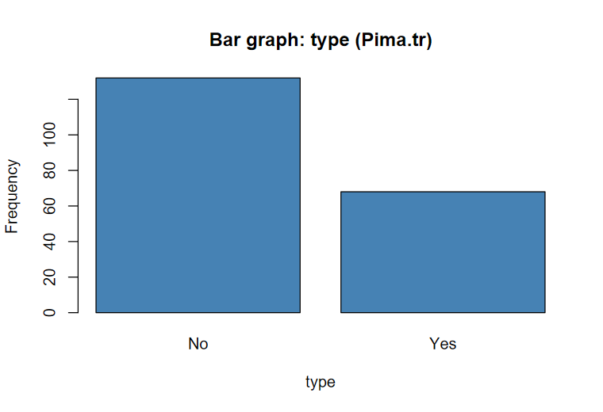
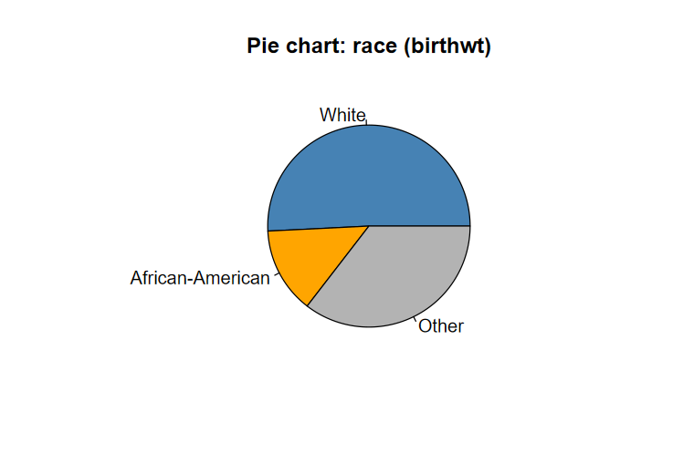
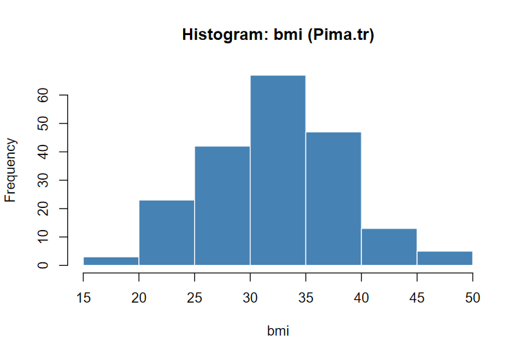
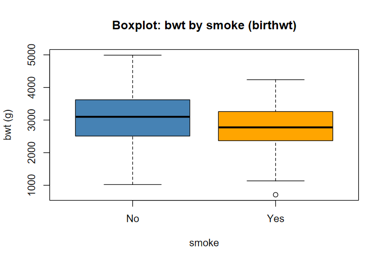
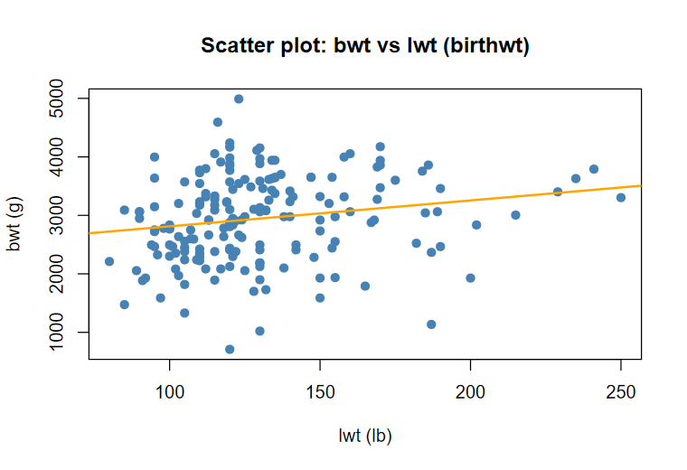
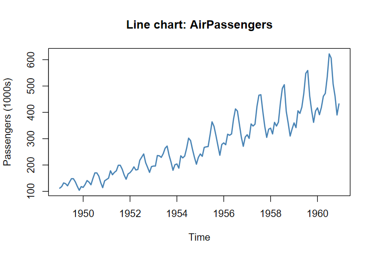

<!--
  第 1 章　概論及敘述統計學
  編輯說明請看 docs/CONTENT.md
  · 行內公式用 $...$，獨立公式用 $$...$$(LaTeX 語法)
  · 圖片放在 img/，用  插入
  · 以 > 開頭的段落會顯示成橘色提示框
-->

## 統計學是什麼？

**統計學(Statistics)是一門研究如何從雜亂無章的數據中，提煉出有用資訊的學問。**

一份原始資料可能有成千上萬筆數字，直接看只是一堆雜訊；統計學提供一套方法，讓我們把資料「整理、摘要、解讀」，進而做出判斷與決策。統計學大致分成兩部分：

- **敘述統計(Descriptive Statistics)**：用表格、圖形與數字(平均數、標準差…)整理並描述手上的資料，讓人一眼看懂。
- **推論統計(Inferential Statistics)**：用樣本去推估(第 7、8 章)或檢驗(第 9～13 章)母體的特性，並說明推論有多可靠；兩者之間的橋樑就是機率(第 2～6 章)。

| 名詞 | 意義 | 符號 |
|---|---|---|
| 母體(population) | 想研究的對象，具備研究者感興趣的特徵 | 大寫 $N$ |
| 樣本(sample) | 實際蒐集到的一部分對象 | 小寫 $n$ |
| 母數(parameter) | 描述母體特徵的數值，通常固定未知 | 希臘字母 $\mu,\ \sigma^2,\ p$ |
| 統計量(statistic) | 由樣本計算的數值，可對於未知母數進行統計推論 | 英文字母 $\bar{x},\ s^2,\ \hat{p}$ |
| 變數(variable) | 每個觀察對象身上被記錄的特徵 | $X$、$Y$ |
| 觀察值(observation) | 變數在某一個對象上的取值 | $x_1, x_2, \dots, x_n$ |

## 變數的測量尺度

依照「數字能做哪些運算」，變數可以分成四種測量尺度(scales of measurement)，由低到高，高層級的尺度具備低層級的所有性質：

| 尺度 | 特性 | 可用運算 | 例子 |
|---|---|---|---|
| 名義尺度(nominal scale) | 只能分類、貼標籤，類別之間沒有順序 | $=,\ \neq$ | 性別、血型、種族(birthwt 的 `race`)、是否吸菸 |
| 順序尺度(ordinal scale) | 可以排序，但類別之間的「差距」沒有意義 | $=,\ \neq,\ <,\ >$ | 癌症分期 I～IV、滿意度(非常不滿意～非常滿意)、信用評等 |
| 等距尺度(interval scale) | 差距有意義，但**沒有絕對零點**，不能算倍數 | 再加上 $+,\ -$ | 攝氏溫度(20°C 不是 10°C 的兩倍熱)、西元年份 |
| 比例尺度(ratio scale) | 有**絕對零點**(0 代表「沒有」)，可以算倍數 | 再加上 $\times,\ \div$ | 出生體重(birthwt 的 `bwt`)、身高、年齡、股價 |

> **判斷小技巧**：問自己「能不能說 A 是 B 的兩倍？」能 → 比例尺度；不能但相減有意義 → 等距尺度；只能比大小 → 順序尺度；只能分類 → 名義尺度。

## 資料的分類

| 資料類型 | 包含的尺度 | 細分 | 例子(R 的 `MASS::birthwt`) |
|---|---|---|---|
| **類別資料**(categorical / qualitative data) | 名義、順序 | 名義型、順序型 | `race`(種族)、`smoke`(是否吸菸)、`low`(是否低體重) |
| **數值資料**(numerical / quantitative data) | 等距、比例 | **離散型**：可數的值(計數)<br>**連續型**：某區間內任意值 | 離散：`ptl`(早產次數)、`ftv`(產檢次數)<br>連續：`bwt`(出生體重)、`lwt`(母親體重) |

在 R 裡，類別資料應該存成**因子(factor)**，數值資料存成 numeric。`birthwt` 的類別變數原本用 0/1/2/3 編碼，要先轉成因子，R 才不會把它當成數字計算：

```r
library(MASS)                  # birthwt、Pima.tr 資料都在 MASS 套件
str(birthwt)                   # 查看每個變數的型態
birthwt$race  <- factor(birthwt$race,  labels = c("White", "African-American", "Other"))
birthwt$smoke <- factor(birthwt$smoke, labels = c("No", "Yes"))
```

## 什麼資料用什麼圖？

| 資料 | 想看什麼 | 圖形 | R 函數 |
|---|---|---|---|
| 一個類別變數 | 各類別的次數 | 長條圖(bar graph) | `barplot(table(x))` |
| 一個類別變數 | 各類別佔整體的比例 | 圓餅圖(pie chart) | `pie(table(x))` |
| 一個數值變數 | 分配的形狀(對稱、偏態、雙峰) | 直方圖(histogram) | `hist(x)` |
| 一個數值變數 | 少量資料的分配，保留原始數值 | 莖葉圖(stem-and-leaf plot) | `stem(x)` |
| 一個數值變數(可分組比較) | 五數摘要、離群值 | 盒形圖(boxplot) | `boxplot(y ~ group)` |
| 兩個數值變數 | 兩者的關係 | 散佈圖(scatter plot) | `plot(x, y)` |
| 隨時間變化的數值 | 趨勢與季節性 | 折線圖(line chart) | `plot(ts)` |

**長條圖：** `Pima.tr` 中是否患有糖尿病(`type`)的人數。

```r
barplot(table(Pima.tr$type), col = "steelblue",
        main = "Bar graph: type (Pima.tr)", xlab = "type", ylab = "Frequency")
```



**圓餅圖：** `birthwt` 中母親種族(`race`)的組成比例。

```r
pie(table(birthwt$race), col = c("steelblue", "orange", "grey70"),
    main = "Pie chart: race (birthwt)")
```



**直方圖：** `Pima.tr` 中 BMI 的分配，大致呈對稱的鐘形(偏態係數約 0.03)。

```r
hist(Pima.tr$bmi, col = "steelblue", border = "white",
     main = "Histogram: bmi (Pima.tr)", xlab = "bmi")
```



**莖葉圖：** `birthwt` 中母親年齡(`age`)。

```r
stem(birthwt$age)
#   The decimal point is at the |
#   14 | 000000
#   16 | 0000000000000000000
#   18 | 00000000000000000000000000
#   ...
```

**盒形圖：** 依母親是否吸菸(`smoke`)比較嬰兒出生體重(`bwt`)，吸菸組的中位數較低，且有一個離群值。

```r
boxplot(bwt ~ smoke, data = birthwt, col = c("steelblue", "orange"),
        main = "Boxplot: bwt by smoke (birthwt)", xlab = "smoke", ylab = "bwt (g)")
```



**散佈圖：** 母親體重(`lwt`)與嬰兒出生體重(`bwt`)的關係，橘線為迴歸直線(第 11 章)。

```r
plot(bwt ~ lwt, data = birthwt, pch = 19, col = "steelblue",
     main = "Scatter plot: bwt vs lwt (birthwt)", xlab = "lwt (lb)", ylab = "bwt (g)")
abline(lm(bwt ~ lwt, data = birthwt), col = "orange", lwd = 2)
```



**折線圖：** R 內建的 `AirPassengers`(1949～1960 每月航空旅客數)，可看出上升趨勢與季節性。

```r
plot(AirPassengers, col = "steelblue", lwd = 2,
     main = "Line chart: AirPassengers", ylab = "Passengers (1000s)")
```



## 敘述統計量

敘述統計量依照描述的特徵分成四類。以下公式中，$x_1, \dots, x_n$ 為樣本觀察值，$x_{(1)} \le x_{(2)} \le \dots \le x_{(n)}$ 為由小到大排序後的**順序統計量**；母體以 $N$、$\mu$、$\sigma$ 表示。

| 特徵 | 回答的問題 | 統計量 |
|---|---|---|
| 一、集中趨勢(central tendency) | 資料的中心在哪裡？ | 算術平均數、中位數、眾數 |
| 二、相對位置(relative position) | 某個值在資料中排在哪裡？ | 百分位數、十分位數、四分位數、Z 分數 |
| 三、離散程度(dispersion) | 資料分散得多開？ | 變異數、標準差、變異係數 |
| 四、分配形狀(shape) | 分配是否對稱？尾巴多厚？ | 偏態係數、峰態係數 |

### 一、集中趨勢

**算術平均數(arithmetic mean)**：所有觀察值的總和除以個數。

$$
\mu = \frac{1}{N}\sum_{i=1}^{N} X_i \quad(\text{母體}), \qquad
\bar{x} = \frac{1}{n}\sum_{i=1}^{n} X_i \quad(\text{樣本})
$$

- 用到每一筆資料，數學性質好，是最常用的中心指標；但**容易受極端值影響**。例：$\{74, 79, 80, 81, 85\}$ 的 $\bar{x} = 79.8$，把 74 換成 7 後 $\bar{x} = 66.4$，已不能代表資料中心。

**中位數(median)**：排序後位於正中間的值。

$$
M_e =
\begin{cases}
X_{\left(\frac{n+1}{2}\right)}, & n \text{ 為奇數} \\[8pt]
\dfrac{1}{2}\left[\, X_{\left(\frac{n}{2}\right)} + X_{\left(\frac{n}{2}+1\right)} \right], & n \text{ 為偶數}
\end{cases}
$$

- 只看位置、不看大小，**不受極端值影響(具穩健性 robustness)**。上例兩組資料的中位數都是 80。
- 中位數不是唯一，當 & n \text{ 為偶數}，理論上{\left(\frac{n}{2}\right)} + X_{\left(\frac{n}{2}+1\right)}之間的任一實數都可以。

**眾數(mode)**：出現次數最多的值，可能不只一個(雙峰、多峰)，也可能不存在。

$$
M_o = \underset{x}{\arg\max}\; f(x)
\qquad\qquad
M_o \approx L + \frac{\Delta_1}{\Delta_1 + \Delta_2} \times w \quad(\text{分組資料})
$$

- $f(x)$ 為次數；分組資料中 $L$ 為眾數組下限、$w$ 為組距、$\Delta_1$、$\Delta_2$ 分別為眾數組次數減去前一組、後一組次數。
- 唯一適用於**名義尺度**的集中趨勢量數。

### 二、相對位置

**百分位數(percentile)**：第 $p$ 百分位數 $P_p$ 表示至少有 $p\%$ 的資料小於或等於它。R 預設(`type = 7`)的計算方式：令

$$
h = (n-1)\,\frac{p}{100} + 1, \qquad
P_p = x_{(\lfloor h \rfloor)} + \bigl(h - \lfloor h \rfloor\bigr)\bigl[\, x_{(\lfloor h \rfloor + 1)} - x_{(\lfloor h \rfloor)} \bigr]
$$

- 即在相鄰兩個順序統計量之間做線性內插。許多教科書用位置 $(n+1)\frac{p}{100}$(R 的 `type = 6`)，結果會略有不同，資料量大時差異很小。

**十分位數(decile)**與**四分位數(quartile)**：都是特定的百分位數。

$$
D_k = P_{10k}\quad(k = 1, \dots, 9), \qquad
Q_1 = P_{25},\quad Q_2 = P_{50} = M_e,\quad Q_3 = P_{75}
$$

- **四分位距** $\mathrm{IQR} = Q_3 - Q_1$：中間 50% 資料的範圍。
- **五數摘要**：$\{\min,\ Q_1,\ M_e,\ Q_3,\ \max\}$，就是盒形圖的骨架；落在 $[\,Q_1 - 1.5\,\mathrm{IQR},\ Q_3 + 1.5\,\mathrm{IQR}\,]$ 之外的點視為可能的離群值。

**Z 分數(z-score，標準分數)**：觀察值距離平均數幾個標準差。

$$
z = \frac{X - \mu}{\sigma}\quad(\text{母體}), \qquad
z_i = \frac{X_i - \bar{X}}{s}\quad(\text{樣本})
$$

- 沒有單位，可以比較不同尺度的資料；一組資料轉成 Z 分數後，平均數為 0、標準差為 1。
- $|z| > 3$ 常被視為離群值。

### 三、離散程度

**變異數(variance)**：離均差平方的平均。

$$
\sigma^2 = \frac{1}{N}\sum_{i=1}^{N}(X_i - \mu)^2, \qquad
s^2 = \frac{1}{n-1}\sum_{i=1}^{n}(X_i - \bar{X})^2 = \frac{1}{n-1}\left(\sum_{i=1}^{n} X_i^2 - n\bar{X}^2\right)
$$

- 樣本變異數除以 $n-1$(自由度)，使 $E(s^2) = \sigma^2$，是母體變異數的**不偏估計式**(證明見第 7 章)。
- 單位是原單位的平方(例如 g²)，不易直接解讀。
- 兩組資料合併後，通常都比原先各自變異數還大，WHY?

**標準差(standard deviation)**：變異數的正平方根，單位與原資料相同。

$$
\sigma = \sqrt{\sigma^2}, \qquad s = \sqrt{s^2}
$$

- 例：病人 A 的血壓 $\{95, 98, 96, 95, 96\}$、病人 B 的血壓 $\{85, 106, 88, 105, 96\}$，平均數都是 96，但 $s_A = 1.22 < s_B = 9.56$，B 的血壓波動大得多。

**變異係數(coefficient of variation)**：標準差相對於平均數的大小。

$$
CV = \frac{\sigma}{\mu} \times 100\% \quad(\text{母體}), \qquad
CV = \frac{s}{\bar{X}} \times 100\% \quad(\text{樣本})
$$

- 沒有單位，用來比較**單位不同或平均數相差很大**的資料的相對離散程度；只適用於比例尺度且平均數為正的資料。

### 四、分配形狀

定義樣本的第 $k$ 階**中央動差**(central moment)：

$$
m_k = \frac{1}{n}\sum_{i=1}^{n}(X_i - \bar{X)^k
$$

- 一階動差含有中央趨勢資訊，二階動差含有分散趨勢資訊。

**偏態係數(coefficient of skewness)**：衡量分配的對稱性。

$$
\gamma_1 = \frac{E\left[(X-\mu)^3\right]}{\sigma^3}\quad(\text{母體}), \qquad
g_1 = \frac{m_3}{m_2^{3/2}}\quad(\text{樣本}), \qquad
Sk_P = \frac{3(\bar{X} - M_e)}{s}\quad(\text{Pearson 偏態係數})
$$

| 偏態係數 | 形狀 | 平均數、中位數、眾數 |
|---|---|---|
| $g_1 > 0$ | 右偏(正偏)，右尾較長 | $\bar{X} > M_e > M_o$ |
| $g_1 = 0$ | 對稱 | $\bar{X} = M_e = M_o$ |
| $g_1 < 0$ | 左偏(負偏)，左尾較長 | $\bar{X} < M_e < M_o$ |

**峰態係數(coefficient of kurtosis)**：衡量分配的尾部厚度(峰的尖平)。

$$
\beta_2 = \frac{E\left[(X-\mu)^4\right]}{\sigma^4}\quad(\text{母體}), \qquad
b_2 = \frac{m_4}{m_2^{2}}\quad(\text{樣本}), \qquad
\text{超額峰態} = b_2 - 3
$$

| 峰態係數 | 名稱 | 形狀 |
|---|---|---|
| $b_2 > 3$ | 高狹峰(leptokurtic) | 峰較尖、尾巴較厚(肥尾) |
| $b_2 = 3$ | 常態峰(mesokurtic) | 與常態分配相同 |
| $b_2 < 3$ | 低闊峰(platykurtic) | 峰較平、尾巴較薄 |

> Excel、SPSS 的 `SKEW`、`KURT` 使用小樣本修正版：$G_1 = \dfrac{\sqrt{n(n-1)}}{n-2}\,g_1$、$G_2 = \dfrac{n-1}{(n-2)(n-3)}\bigl[(n+1)(b_2-3)+6\bigr]$(後者已是超額峰態)。不同軟體的數值略有差異。

### R 實作：birthwt 的出生體重

```r
library(MASS)
x <- birthwt$bwt                       # 189 位嬰兒的出生體重(g)
n <- length(x)

mean(x)                                # 算術平均數 2944.59
median(x)                              # 中位數 2977
tb <- table(x); names(tb)[tb == max(tb)]   # 眾數 3062(R 沒有內建眾數函數)

quantile(x, c(0.25, 0.5, 0.75))        # 四分位數 2414, 2977, 3487
quantile(x, seq(0.1, 0.9, by = 0.1))   # 十分位數(D1 = 2038 … D9 = 3864.8)
fivenum(x); summary(x)                 # 五數摘要
IQR(x)                                 # 四分位距 1073

var(x)                                 # 變異數 531753.5(除以 n - 1)
sd(x)                                  # 標準差 729.21
sd(x) / mean(x) * 100                  # 變異係數 24.76%

z <- (x - mean(x)) / sd(x)             # 或 scale(x)；第 1 筆 2523 g 的 z = -0.578

m <- function(k) mean((x - mean(x))^k) # 中央動差
m(3) / m(2)^1.5                        # 偏態係數 g1 = -0.207(略為左偏)
m(4) / m(2)^2                          # 峰態係數 b2 = 2.887(超額峰態 -0.113，接近常態)
```

| 統計量 | 結果 | 統計量 | 結果 |
|---|---|---|---|
| 平均數 $\bar{x}$ | 2944.59 g | 變異數 $s^2$ | 531753.5 g² |
| 中位數 $M_e$ | 2977 g | 標準差 $s$ | 729.21 g |
| 眾數 $M_o$ | 3062 g | 變異係數 $CV$ | 24.76% |
| $Q_1$ / $Q_3$ | 2414 / 3487 g | 偏態係數 $g_1$ | −0.207 |
| $D_1$ / $D_9$ | 2038 / 3864.8 g | 峰態係數 $b_2$ | 2.887 |

> **金融用語**：報酬率的標準差就是「波動度」，日報酬標準差 $\times \sqrt{252}$ ≈ 年化波動度。下方用本站的台股加權指數資料計算各項敘述統計量，可以看到股市報酬的超額峰態明顯大於 0，也就是常說的「肥尾」。
